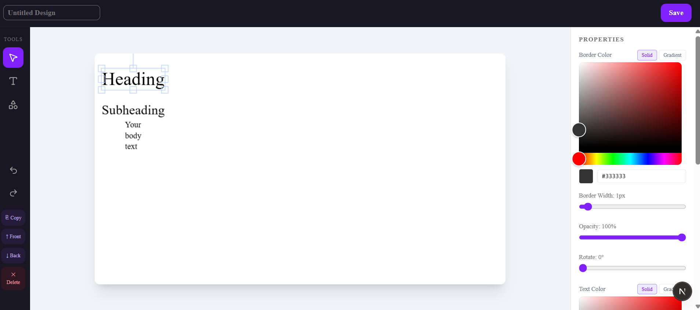
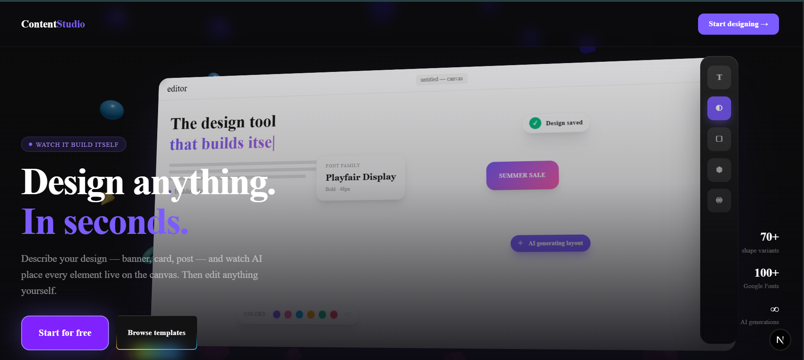
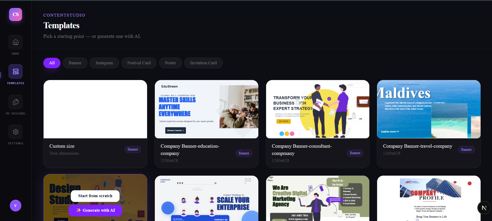

# ContentStudio

A browser-based design editor built from scratch — — drag shapes, add text, upload images, generate a whole design with AI, and export it.


🔗 [Live demo](https://content-studio-next.vercel.app/) 
- 🎨 [What it looks like] 

## Why I built this

I wanted to actually understand how design tools work under the hood, not just do another CRUD app.The hard parts are undo/redo that doesn't break, text editing that behaves properly, and state that doesn't break once you have 10+ tools all touching the same canvas.

## What it does

**Canvas editor**
- Fabric.js canvas — move, resize, rotate, layer objects, undo/redo
- Text editing on canvas + synced sidebar inputs
- Shapes, icons (Iconify), illustrations, photo upload with crop
- Google Fonts, searchable
- Full property panel — fill, stroke, opacity, corner radius, rotation, text styling
- Copy/paste, custom canvas sizes (or pick a template)
- Export to PNG

**Undo/redo**
Diff-based commits instead of hooking every Fabric event — `commit()` serializes the canvas to JSON, only pushes to history if something actually changed. One history stack for keyboard shortcuts, sidebar edits, and on-canvas editing.

**AI generation**
Describe the design → Gemini returns structured JSON → loads straight into Fabric as editable objects, fonts and all.

**Auth + saves**
Supabase auth (email/password + Google), with a proper account settings page — change password, sign out, delete all designs, delete account. RLS so users only see their own designs. Thumbnails upload to S3, tested locally against LocalStack since I didn't have a card for real AWS billing — falls back to Supabase Storage automatically once deployed, so it works either way with no code changes.

**Home page**
Hero is a self-assembling canvas demo — a browser mockup flies in with 3D CSS transforms, a toolbar drops onto it, then shapes/text/images get "dragged" on one by one like the product is building itself. Below that, a 3D rotating template carousel (drag or auto-spin).

## Tech stack
 
**Frontend:** Next.js (App Router), Tailwind CSS, Fabric.js for the canvas, Zustand for state, Framer Motion + GSAP for animation
 
**Backend/data:** Supabase (Postgres + Auth + Storage), Google Gemini API for AI generation
 
**File storage:** AWS S3 SDK, tested locally against LocalStack (since I didn't have a card to set up real AWS billing 😅) — falls back to Supabase Storage automatically once deployed, no AWS account needed to actually run this

## Running locally

```bash
git clone https://github.com/yourusername/content-studio
cd content-studio
npm install
```


Optional — for local S3 thumbnail storage (skip this and it just uses Supabase Storage instead):
```bash
docker compose up -d
awslocal s3 mb s3://contentstudio-exports
```

```bash
npm run dev
```

## Database

One `Designs` table: `id`, `user_id`, `title`, `template_id`, `canvas_json`, `thumbnail`, `created_at`, `updated_at`. RLS policy: `auth.uid() = user_id`.

## Things I actually debugged, not just built

- Fabric's `loadFromJSON` is async — event listeners could fire mid-restore and corrupt undo history. Fixed with an `isRestoringRef` flag that blocks commits during a restore.
- Ref-bridge pattern for canvas functions living inside a `useEffect` closure, since Zustand can't hold a Fabric canvas instance directly.
- Fixed a duplicate-row save bug (was inserting unconditionally, then inserting/updating again right after).
- Fought Docker/WSL2 on Windows for way too long just to get LocalStack running.

## What's next

- More templates per category
- Version history for designs

---




---
Built by Vaishnavi Khedekar
